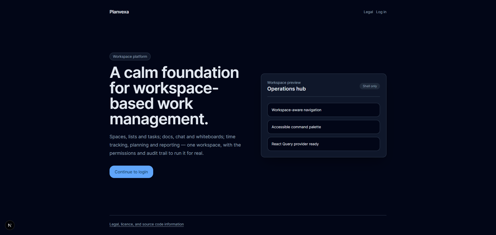
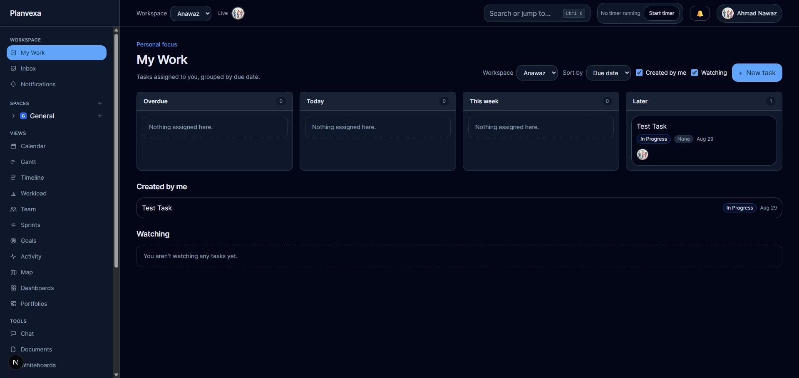
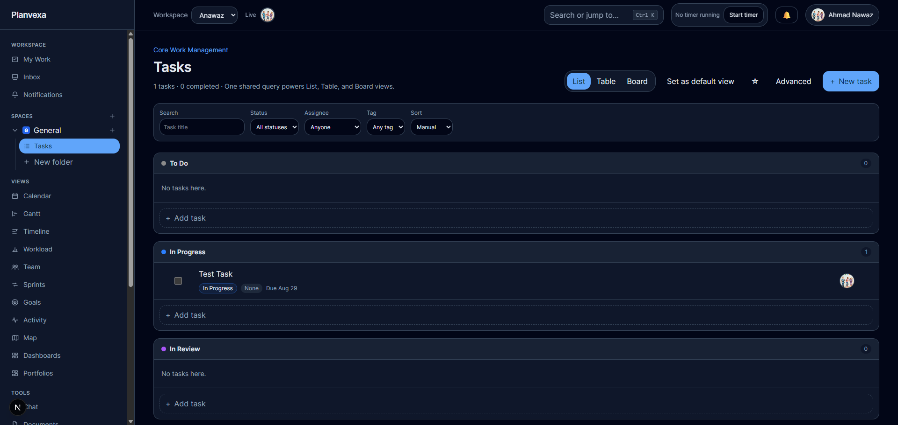
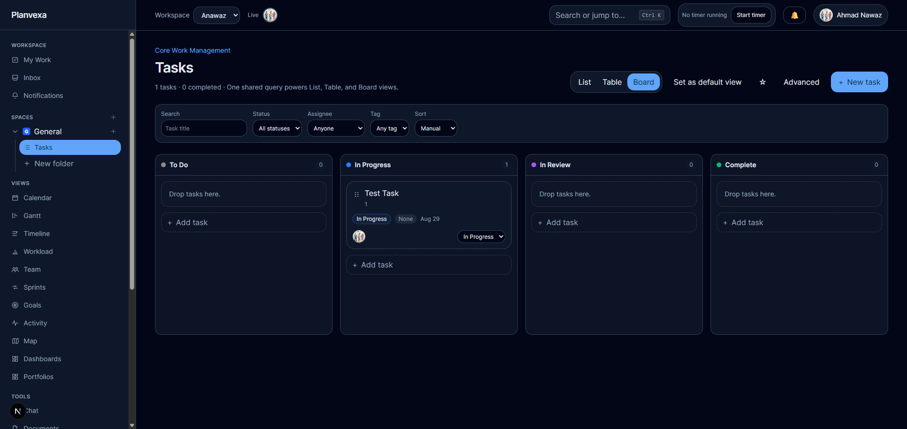
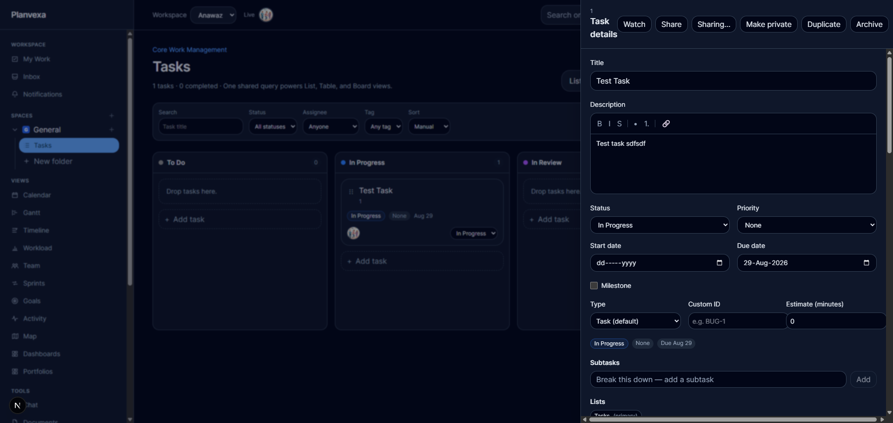

# Planvexa

A workspace-scoped, **full-featured** task-management SaaS platform — project management, collaboration,
time tracking, reporting, automation, integrations and enterprise controls.

Built as a **modular monolith** so that bounded contexts can later be extracted into services without
re-architecting. Multi-tenancy, authorization and auditing are foundational, not bolted on.

> See `AGENTS.md` for the execution protocol every contributor (human or AI) must follow.

## Screenshots

| | |
| --- | --- |
|  |  |
| Home | My Work |
|  |  |
| Tasks List | Tasks Board |
|  | |
| Task Edit | |

## Tech stack

| Area | Technology |
| --- | --- |
| Backend | ASP.NET Core on .NET 10 LTS |
| Data | PostgreSQL 18 + EF Core 10 (Npgsql); Dapper for heavy reads |
| Identity | Keycloak (OIDC), app-side membership/roles/entitlements |
| Realtime | ASP.NET Core SignalR |
| Messaging | Transactional outbox → workers → NATS JetStream (later) |
| Frontend | Next.js 16, React 19, TypeScript, Tailwind, Radix/shadcn, TanStack |
| Observability | OpenTelemetry → Prometheus/Grafana/Loki/Tempo |
| Packaging | Docker, Kubernetes, Helm, OpenTofu, Argo CD |

## Repository layout

```
apps/            web (Next.js), api (ASP.NET Core), apphost (Aspire)
                 collaboration/ (Node/TypeScript Hocuspocus server, realtime document editing)
                 worker/ is reserved, currently empty
src/             BuildingBlocks, SharedContracts, Modules/*, Infrastructure
tests/           Unit, Integration, Architecture, EndToEnd, Security, Performance
infrastructure/  docker, helm, opentofu, argocd
scripts/         dev + ops scripts
```

## Modules

The web client is wired to the live API: it calls `/api/v1` through a Next.js BFF proxy (`apps/web/src/app/api/proxy`), authenticates against Keycloak via OIDC, subscribes to the SignalR workspace hub for realtime updates, uploads/downloads attachments, and uses the AI endpoints backed by the workspace's configured provider. Database deployment is DbUp (EF migrations are gone), and local orchestration runs through the Aspire AppHost.

| Module (`src/Modules/*`) | Responsibility |
| --- | --- |
| Identity, Workspace Access, Audit | users, workspaces/roles/entitlements, immutable audit trail |
| WorkManagement | spaces → folders → lists → tasks, custom fields, dependencies, recurring tasks |
| Collaboration, Notifications | threaded comments, mentions, reactions, share links; durable inbox + email |
| Chat | workspace channels (public/private) + realtime messages (threading, edit, moderation) |
| TimeTracking | timers, manual entries, timesheets, rates, DST-safe reporting |
| Planning, Reporting | calendar/gantt/workload/sprints; dashboards + portfolio reporting |
| Documents, Forms | versioned documents; public form intake → task creation |
| Automations, Integrations | trigger→condition→action engine; signed webhooks + personal access tokens |
| Governance | audit-log export, security settings, retention, governed exports |
| Ai, Mobile | permission-aware AI assistance; device registration + delta sync |

The web client is also an installable PWA (manifest + service worker, `apps/web/public/`) with offline
reading of already-visited tasks and a workspace-scoped IndexedDB outbox for offline task/comment/
time-entry mutations, replayed on reconnect — see `apps/web/src/lib/offline/`.

## Getting started (local development)

**Prerequisites**

| Requirement | Notes |
| --- | --- |
| [.NET 10 SDK](https://dotnet.microsoft.com/download) | `dotnet --version` must report `10.*` |
| [Node 24+](https://nodejs.org) | `npm` must be on `PATH` |
| [Docker Desktop](https://www.docker.com/products/docker-desktop) | must be **running**; Keycloak, Mailpit and Jaeger are containers |
| [PowerShell 7+](https://learn.microsoft.com/powershell) (`pwsh`) | the AppHost shells out to `scripts/*.ps1` |
| PostgreSQL 18 on `localhost:5432` | **host-provided.** Planvexa never starts, stops or configures the server itself |

All commands below are Windows PowerShell; they work on macOS/Linux `pwsh` with forward-slash paths.

#### One-time PostgreSQL setup (manual — the tooling deliberately will not do this)

Planvexa creates *databases*, never the server or its login roles. Run this once as a PostgreSQL
superuser (`psql -U postgres`):

```sql
CREATE ROLE planvexa LOGIN CREATEDB PASSWORD 'planvexa';
```

`CREATEDB` is what lets `scripts/ensure-databases.ps1` create the `planvexa` and `keycloak` databases
on first start. If your `planvexa` role must not have it, create the two databases yourself instead:

```sql
CREATE DATABASE planvexa OWNER planvexa;
CREATE DATABASE keycloak OWNER planvexa;
```

Optional: cross-workspace background sweeps (outbox, notifications, recurring, export/retention) use a
privileged `planvexa_maint` role — see [`ConnectionStrings:PlanvexaMaintenance`](src/Infrastructure/Planvexa.Infrastructure/Persistence/MaintenanceConnection.cs).
It needs `BYPASSRLS`, so only a superuser can create it. Without it those sweeps fall back to the
application connection, which is fine for day-to-day development:

```sql
CREATE ROLE planvexa_maint LOGIN BYPASSRLS PASSWORD 'planvexa_maint';
```

`scripts/ensure-databases.ps1` provisions and grants that role for you whenever its connection is
allowed to create roles; set `PLANVEXA_ADMIN_CONNECTION_STRING` to a superuser connection if the
`planvexa` login is not. When it cannot, it warns and continues — the sweeps fall back to the
application connection.

### 1. Start everything: F5 the Aspire AppHost (primary route)

Open `Planvexa.slnx` in Visual Studio, set **`Planvexa.AppHost`** as the startup project
(right-click → *Set as Startup Project* — the `.slnx` format has no element for a default startup
project, Visual Studio stores that choice per-user in `.vs/`, so this is a one-time step per clone)
and press **F5**. The Aspire dashboard opens automatically.

The CLI equivalent is:

```powershell
dotnet run --project apps/apphost/Planvexa.AppHost.csproj
```

Either way the AppHost brings up the whole stack in dependency order and reports honest health in the
dashboard:

| Resource | Kind | What it does |
| --- | --- | --- |
| `db-bootstrap` | executable | `scripts/ensure-databases.ps1` — creates the `planvexa` and `keycloak` databases if missing, then exits |
| `mailpit`, `jaeger` | containers | SMTP sink and trace collector |
| `keycloak` | container | waits for `db-bootstrap`; healthy only once the `planvexa` realm exists |
| `keycloak-bootstrap` | executable | `scripts/keycloak-bootstrap.ps1` — creates the realm, clients and dev users, then exits |
| `web-install` | executable | `npm ci` in `apps/web` when `node_modules` is missing, then exits |
| `api` | project | waits for `db-bootstrap` + `keycloak-bootstrap`; runs DbUp and seeds demo data; health `/health/ready` |
| `web` | executable | waits for `web-install` + a healthy `api`; health `/login` |

| Service | URL / Port |
| --- | --- |
| Web app | `http://localhost:3000` |
| API (+ docs at `/scalar/v1`) | `http://localhost:8080` |
| Keycloak | `http://localhost:8081` |
| Mailpit (email) | `http://localhost:8025` |
| Jaeger (traces) | `http://localhost:16686` |
| PostgreSQL (host-provided) | `localhost:5432` (db `planvexa`, user `planvexa`, password `planvexa`) |

Development sign-ins: `owner@planvexa.local`, `admin@planvexa.local`, `member@planvexa.local`,
`guest@planvexa.local` — password `PlanvexaDev!123` (override with `PLANVEXA_DEV_PASSWORD`).

Connection strings default to the values in `apps/apphost/appsettings.Development.json`. Override them
per machine with user secrets (`dotnet user-secrets --project apps/apphost set ConnectionStrings:Planvexa "..."`)
or the `ConnectionStrings__Planvexa` / `ConnectionStrings__PlanvexaMaintenance` environment variables.

### 1b. CLI equivalent with a readiness wait

`scripts/dev-up.ps1` does the same thing from a terminal: it validates the toolchain, calls the same
`scripts/ensure-databases.ps1`, starts the AppHost in the background (writing `.run/apphost.json` and
`.run/logs/`) and blocks until the API and web app respond.

```powershell
pwsh scripts/dev-up.ps1
# ...later, to stop:
pwsh scripts/dev-down.ps1
```

### 2. Build and test the backend

The solution is the **`.slnx`** format (new .NET 10 XML solution). The build treats **warnings as errors**.

```powershell
$env:DOTNET_CLI_TELEMETRY_OPTOUT = 1

dotnet build Planvexa.slnx -c Release           # whole solution (0 warnings / 0 errors)
dotnet test  Planvexa.slnx                        # unit + architecture + integration
```

> **Integration tests need Docker running** — they spin up a real PostgreSQL 18 via
> [Testcontainers](https://testcontainers.com) and run every migration (including Row-Level Security) on a
> fresh database, so the schema under test is identical to production. To run just the fast suites without
> Docker:
>
> ```powershell
> dotnet test tests/Unit/Planvexa.UnitTests/Planvexa.UnitTests.csproj
> dotnet test tests/Architecture/Planvexa.ArchitectureTests/Planvexa.ArchitectureTests.csproj
> ```

> **Stop the API before a Release build/test.** A running `Planvexa.Api` locks its own
> `bin/Release/net10.0` output, so `dotnet build`/`dotnet test -c Release` fails to copy dependencies
> into it (`MSB3021 … used by another process`). Every test project that references the API then fails
> to build and its tests silently do not run. Use `-c Debug` while the dev stack is up, or stop the API
> first.

### 3. Run the API

```powershell
dotnet run --project apps/api/Planvexa.Api
```

- Listens on **`http://localhost:8080`** (Development).
- In Development it **runs DbUp on startup** (`Database:RunDbUpOnStartup: true`),
  so the schema is created automatically against the PostgreSQL instance in `ConnectionStrings:Planvexa`.
- **API docs:** OpenAPI at `http://localhost:8080/openapi/v1.json`, interactive
  [Scalar](https://scalar.com) reference at `http://localhost:8080/scalar/v1`.
- **Realtime hub:** SignalR at `/hubs/workspace`.
- **Health:** `/health/live`, `/health/ready`.

**Exercising the API in Development** — a dev auth handler lets you call authenticated endpoints without
Keycloak by sending identity + workspace header (production uses Keycloak JWT bearer tokens instead):

| Header | Meaning |
| --- | --- |
| `X-Debug-Subject` | external subject id (any stable string identifies a user) |
| `X-Debug-Email` / `X-Debug-Name` | optional profile fields |
| `X-Workspace` | workspace **id** (GUID) for workspace-scoped endpoints |
| `Idempotency-Key` | optional, for safe retries on supported POSTs |

Typical first calls: `POST /api/v1/workspaces` (create or join a workspace) → use the returned workspace id as `X-Workspace`. `GET /api/v1/workspaces` lists memberships for the signed-in user.

### 4. Run the web client

```powershell
cd apps/web
npm ci
npm run lint      # eslint
npm run typecheck # tsc --noEmit
npm run build     # production build
npm run dev       # dev server (http://localhost:3000)
```

> **Building while the dev server is running?** Set `NEXT_DIST_DIR=.next-verify` first. `next dev`
> and `next build` both write `.next` by default, and running them together tears the files in it —
> leaving the dev server serving stale modules whose exports no longer match source (`<symbol> is not
> a function`). The AppHost repairs an obviously-poisoned `.next` on startup, but only the separate
> build directory prevents the collision. Deployment builds are unaffected and still use `.next`.

> If you run the dev server by hand (outside the AppHost), set
> `NODE_OPTIONS=--max-http-header-size=65536` first. Browsers share `localhost` cookies across all
> ports, so other dev tools' cookies plus the chunked session can exceed Node's default 16 KB header
> limit and produce HTTP 431. The AppHost, the web container, and CI already set this.

The client talks to the API through the Next.js BFF proxy at `/api/proxy`, which attaches the OIDC access
token server-side and forwards the `X-Workspace` context header. Point it at a different API
with `NEXT_PUBLIC_PLANVEXA_API_PROXY`.

### 5. Frontend tests

```powershell
cd apps/web
npm run test      # vitest unit/component tests
npm run test:e2e  # Playwright end-to-end (needs the API + web dev server running)
```

### Working with database scripts

Database deployment is handled by DbUp. SQL scripts live in `src/Database/Planvexa.Database/Scripts` and are journaled in `platform.schema_versions`. Add schema changes as the next ordered script, keep them safe for upgraded databases, and add/update integration tests for the migration behavior.

```powershell
dotnet test tests/Integration/Planvexa.IntegrationTests/Planvexa.IntegrationTests.csproj -c Release --filter DbUp
```

The API runs DbUp on startup by default (`Database:RunDbUpOnStartup: true`) before hosted workers process outbox/jobs. EF Core remains the runtime ORM only; EF migration classes and the model snapshot are no longer used.

### First-run bootstrap (every environment)

A database with a schema but no rows is not a usable install — nobody can sign in anywhere. So after
DbUp the API runs a one-time bootstrap ([`PlanvexaBootstrap`](apps/api/Planvexa.Api/Startup/PlanvexaBootstrap.cs)):
if the configured admin has no workspace, it creates one admin user and one workspace through the same
`WorkspaceRegistrationService` path the product's own onboarding uses — built-in roles, entitlements,
starter status scheme / Space / List — then self-skips on every later start. Configure with
`Bootstrap:AdminSubject` (must match the Keycloak account's `sub`), `Bootstrap:AdminEmail`,
`Bootstrap:AdminDisplayName`, `Bootstrap:WorkspaceName`; disable with `Bootstrap:Enabled=false`.

It defers to the demo seed below: when `Database:SeedDevelopmentData` is on, that seed already leaves a
usable install behind (and owns `admin@planvexa.local`), so the bootstrap skips. Local development
therefore behaves exactly as it always has. See [`docs/runbooks/install.md`](docs/runbooks/install.md)
for the production shape.

### Controlling self-registration

`Registration:AllowSelfRegistration` (default `true`) decides whether a brand-new identity may
provision itself an account. Set it to `false` to make the workspace invite-only: an identity that has
never been seen before is only provisioned if its email has a pending workspace invitation; otherwise
the API rejects it with `403 Forbidden`. Account creation via an invitation link is **always** allowed
regardless of this setting. It has no effect on existing users, and the first-run bootstrap admin above
always bypasses it (it's explicit, config-driven provisioning, not self-service).

This is an app-level gate on top of Keycloak's own `registrationAllowed` realm setting
(`scripts/keycloak-bootstrap.ps1`) — Keycloak controls whether its hosted login page offers a
"Register" link at all, while `Registration:AllowSelfRegistration` controls whether a newly registered
(or otherwise never-seen) identity is actually allowed to use the product.

### Seeded development data

In Development, the API runs deterministic demo seeding after DbUp (`Database:SeedDevelopmentData: true`). It creates the `planvexa-demo` demo workspace set, owner/admin/member/guest users (`dev-owner`, `dev-admin`, `dev-member`, `dev-guest` as external subjects), and representative data across work management, collaboration, chat, time tracking, planning/reporting, documents/forms, automations/integrations, governance, AI, and mobile. The seeder is idempotent and will not duplicate rows. `Database:ResetDevelopmentData` is available only in Development/Testing for disposable demo resets.

#### Development login accounts (local only)

`scripts/keycloak-bootstrap.ps1` creates matching Keycloak accounts for the seeded users. These are
**development-only throwaway credentials** for the local realm — they are never valid outside your
machine. The default password comes from `PLANVEXA_DEV_PASSWORD` (fallback `PlanvexaDev!123`);
per-user overrides: `PLANVEXA_DEV_{OWNER|ADMIN|MEMBER|GUEST}_PASSWORD`.

| Email | Workspace role | Password (default) |
| --- | --- | --- |
| `owner@planvexa.local` | Owner | `PlanvexaDev!123` |
| `admin@planvexa.local` | Admin | `PlanvexaDev!123` |
| `member@planvexa.local` | Member | `PlanvexaDev!123` |
| `guest@planvexa.local` | Guest | `PlanvexaDev!123` |

Log in at `http://localhost:3000/login` → "Continue with Keycloak".

**Never commit secrets.** The only credential in source control is the throwaway local Postgres password
used by Docker Compose.

## Workspace isolation in one paragraph

Every workspace-owned row carries a non-nullable `WorkspaceId` (UUIDv7). Composite indexes and composite
foreign keys keep child rows within their workspace, PostgreSQL Row-Level Security provides a second
isolation boundary, and the resolved, immutable workspace context (never taken from a request body)
scopes every query, cache key, search index and file path.

Every table carrying a `workspace_id` also has a foreign key to `tenancy.workspaces` with
`ON DELETE CASCADE`, so deleting a workspace (`/app/settings/workspace`, Owner-only and irreversible)
is a single `DELETE` that removes everything it owns. `audit.audit_events` and
`platform.outbox_messages` are excluded on purpose so the audit trail outlives the workspace it
describes. **A new workspace-owned table must declare that foreign key**, or its rows will be left
behind.

## Statuses and workflows

Status schemes are **workspace defaults with optional per-Space overrides**. A Space inherits the
workspace default until it customizes at `/app/spaces/{id}/statuses`; after that its changes affect
only that Space. Workspace defaults live at `/app/settings/statuses` (create, rename, recolour,
reorder and remove statuses, or start from a Kanban/Scrum/Bug-tracking template);
`/app/settings/workflows` remains the separate screen for allowed-transition restrictions.

Because `tasks.status_id` has no foreign key to `statuses`, removing a status always requires naming
a replacement, and the affected tasks are moved to it. See section 11 of
`docs/Planvexa-Product-Specification.md` for the full resolution rules.

## Production deployment

- **Kubernetes/Helm:** `infrastructure/helm/planvexa` deploys the API and web app (built from
  `infrastructure/docker/*.Dockerfile`) — see `infrastructure/helm/README.md`.
- **Cloud infrastructure:** `infrastructure/opentofu` provisions the external, stateful dependencies
  (object storage, managed Postgres) the Helm chart expects — see `infrastructure/opentofu/README.md`.
- **Observability:** `infrastructure/observability` is an optional Prometheus + Grafana + Loki/Promtail
  stack for self-hosters (dev tracing already works via Jaeger without it) — see
  `infrastructure/observability/README.md`.
- **Runbooks:** install, upgrade, backup/restore and disaster-recovery procedures live in
  `docs/runbooks/`.

## Licence

[GNU Affero General Public License, Version 3 only](LICENSE). Copyright © 2026 Planvexa contributors.


